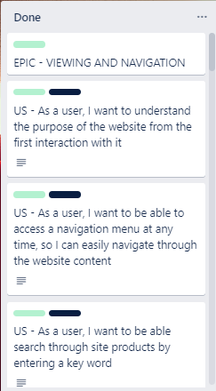

# The Guilty Grape - Online Wine Shop
 

- [The Guilty Grape - Online Wine Shop](#the-guilty-grape---online-wine-shop)
  
  * [Overview](#overview)
  * [UX](#ux)
    + [Strategy
](#strategy-hr-)
    + [Scope
](#scope-hr-)
    + [Structure
](#structure-hr-)
    + [Skeleton
](#skeleton-hr-)
    + [Surface
](#surface-hr-)
      - [Color Scheme](#color-scheme)
      - [Fonts](#fonts)
      - [Visual Effects](#visual-effects)
  * [Business Model](#business-model)
  * [Marketing](#marketing)
  * [Agile Methodology](#agile-methodology)
  * [Features](#features)
    + [Existing Features
](#existing-features-hr-)
      - [Products](#products)
      - [Product Reviews](#product-reviews)
      - [Wishlist](#wishlist)
      - [Bag](#bag)
      - [Checkout](#checkout)
      - [User Profile](#user-profile)
      - [Admin](#admin)
    + [Future Feature Considerations
](#future-feature-considerations-hr-)
  * [Responsive Layout and Design](#responsive-layout-and-design)
  * [Tools Used](#tools-used)
    + [Python packages](#python-packages)
  * [Testing](#testing)
  * [Deployment](#deployment)
    + [Deploy on Heroku](#deploy-on-heroku)
    + [Fork the repository](#fork-the-repository)
    + [Clone the repository](#clone-the-repository)
  * [Credits](#credits)
    + [Content](#content)
    + [Media](#media)
    + [Code](#code)
  * [Acknowledgements](#acknowledgements)

## Overview
The Guilty Grape is an e-commerce website created for a fictive wine shop located in Dublin, Ireland. The main purpose of the project was to implement a fully functional online store that will make the process of selecting and purchasing wine products much easier for customers. 
The users are given the possibility to see every product's details, create a wishlist, add items to the shopping bag, purchase with an online payment and access orders' history. Also, the staff members have permission for controlling the data using specially designed features. 
The website was developed using Python(Django), HTML, CSS and JavaScript. The data was stored in a PostgreSQL database using ElephantSql for manipulation.
  
The fully deployed project can be accessed at [this link](https://the-guilty-grape-wine-shop.herokuapp.com/).  

## UX
This site was created respecting the Five Planes Of Website Design: 
### Strategy

**User Stories:**  

|   EPIC                                |ID|                                User Story                                                   |
| :-------------------------------------|--|:------------------------------------------------------------------------------------------- |
|**VIEWING AND NAVIGATION**             |  ||
|                                       |1A| As a user, I want to understand the purpose of the website from the first interaction with it content |             
|                                       |1B| As a user, I want to be able to easily use the site functionalities on all viewports, so I can shop the products from any device|
|                                       |1C| As a user, I want to see a footer with relevant information and documents|
|                                       |1D| As a user, I want to be able to access a navigation menu at any time, so I can easily navigate through the website content|
|                                       |1E| As a user, I want to be able search through site products by entering a key word|
|**USER REGISTRATION/AUTENTHICATION**   |  || 
|                                       |2A| As a user, I want to be able to register on the website|
|                                       |2B| As a user, I want to be able to confirm my account with an email|
|                                       |2C| As a user/admin, I want to be able to authenticate using only email and password|
|                                       |2D| As a user, I want to be able to reset my password in case I forgot it|
|                                       |2E| As a user/admin, I want to be able to log out at any time|
|**PRODUCTS**                           |  ||
|                                       |3A| US - As a user, I want to see a catalog with all the products and also grouped by categories|
|                                       |3B| US - As a user, I want to be able to apply filters and to sort the listed products, so I can easily find the ones I am interested to buy|
|                                       |3C| US - As a user, I want to be able to see the stock availability for low stock products|
|                                       |3D| US - As a user, I want to see a page with full specifications for every product, so I can easily decide which one I would want to buy|
|                                       |3E| US - As a user, I want to be able to add any product to the shopping bag in a selected quantity|
|                                       |3F| US - As an admin, I want to be able to edit product details|
|                                       |3G|  US - As an admin, I want to be able to delete products from the catalog, so it reflect the existent stock|
|                                       |3H| US - As an admin, I want to be able to add new products to catalog, so it reflects the existent stock|
|**REVIEWS**                            |  ||
|                                       |4A| US - As a user, I want to be able to see all the reviews added for any product, so I can easily make an opinion about its quality|
|                                       |4B| US - As a logged in user, I want to be able to add a review for any product I want|
|                                       |4C| US - As a logged in user, I want to be able to see and edit my reviews added to products|
|                                       |4D| US - As a user, I want to be able to see a general review of every product|
|**WISHLIST**                           |  ||
|                                       |5A| US - As a logged-in user, I want to be able to add/remove any product from the Wishlist|
|                                       |5B| US - As a logged-in user, I want to see all the products added to Wishlist|
|                                       |5C| US - As a logged-in user, I want to be able to apply filters and to sort the products in the Wishlist|
|                                       |5D| US - As a logged-in user, I want to be able to add products to the shopping bag from the Wishlist page|
|                                       |5E| US - As a user, I want to see how many times a product has been added to Wishlist by all the users|        
|**BAG**                                |  ||
|                                       |6A| US - As a user, I want to see all the products I added to the shopping bag|
|                                       |6B| US - As a user, I want to be able to add/remove from the wishlist any product from the shopping bag|
|                                       |6C| US - As a user, I want to see all the details about the price for the order|
|                                       |6D| US - As a user, I want to be able to remove a product from the shopping bag|
|                                       |6E| US - As a user, I want to be able to edit the quantity of the products|
|                                       |6F| US - As a user, I want that all the discounts announced on the website to be applied properly|
|                                       |6G| US - As a user, I want to be able to add my vouchers to the order|
|**CHECKOUT**                           |  ||
|                                       |7A| US - As a logged-in user, I want to be able to see and edit my default delivery details for the order|
|                                       |7B| US- As a user, I want to see the order summary with all the price details|
|                                       |7C| US - As a user, I want to be able to add my delivery details for the order|
|                                       |7D| US - As a user I want to be able to introduce my card details for payment|
|**USER PROFILE**                       |  ||
|                                       |8A| US - As a logged in user, I want to be able to see and edit my delivery details|
|                                       |8B| US - As a logged-in user, I want to be able to see my orders history|
|                                       |8C| US - As a logged-in user, I want to see the full details for every order I placed on the website|
|**ADMIN MANAGE ORDERS**                |  ||
|                                       |9A| US - As an admin, I want to be able to see all the orders placed on the website grouped by date|
|                                       |9B| US -As an admin, I want to be able to filter the orders by date|
|                                       |9C| US -As an admin, I want to see full details of every order placed on the website|
|**NEWSLETTER**                         |  ||
|                                       |10A| US - As a user, I want to be able to subscribe to a newsletter, so I can always be up to date with the latest promotions|

**Project Goal:** 
Create an e-commerce application for The Guilty Grape wine shop that is useful for clients and staff members as well.

**Project Objectives:**  
* To create a website with a simple and intuitive User Experience;
* To add content that is relevant and helps create a better image of the restaurant;
* To differentiate between client and staff member accounts;
* To implement fully functional features that will ease the staff members' tasks and upgrade clients' experience with the restaurant services;
* To make the website available and functional on every device.  

### Scope

**Simple and intuitive User Experience** 
* Ensure the navigation menu is visible and functional at every step;
* Ensure every page has a suggestive name that fits its content;
* Ensure the users will get visual feedback when navigating through pages;
* Create a design that matches the requirements of an e-commerce website.

**Relevant content** 
* Add a representative cover image;
* Add the website title and details about its purpose;
* Add a section that includes information about the shop's name, description, location and contact data;
* Make a clear and beautiful designed presentation of the menu elements;

**Features for upgraded experience** 
* Create a list with all the products and group them by category;
* Create a Bag feature that allows the user to add, update and remove products from the shopping bag;
* Create a Wishlist feature that gives the user the possibility to add and remove items from the wishlist;
* Create a Review feature that displays all the reviews added for a product and allows the user to add and edit his review;
* Create a Checkout feature for giving the user the possibility to complete an order on the website;
* Create a Profile page for the user to add/update his delivery details and see his orders' history;
* Create a Newsletter feature that allows the user to subscribe with his email;
* Create a Voucher feature that offers the user a dicount code on account registration;
* Create a page for the staff members to manage all the orders for all the users;
* Create a feature for the staff members to add/edit products on the website;

**Different client and staff member Accounts** 
* Allow the clients to add/edit reviews and the staff members only the option to read them;
* Give the client permission to add/remove products from wishlist and remove the feature for staff members;
* Only guest and client users to access the shopping bag and its features;
* Only guest and client users can make an order on the website;
* Give permission only for staff members to add/edit products; 
* Allow access to Profile page only for clients users;
* Allow access to Wishlist page only for clients users;
* Allow access to Orders page only for staff member users;

**Responsiveness** 
* Create a responsive design for desktop, tablet and mobile devices.  

### Structure

The structure of the website is divided into multiple pages and the content is displayed depending on authentication and client/admin type of user.  
- **Register/Login** pages give the user the possibility to create an account and authenticate for accessing different features. 
- **Logout** feature is a modal that helps user exit their current account; 
- The **Home** page is visible for both types of users and includes relevant information about the websites' purpose and details a bout the wine shop, location and contact; 
-The **All products** page displays a list with all the products available for selling; 
- The **Wines** navigation link gives the user the possibility to access the list of products grouped by category, <b>Red</b>, <b>White</b>, <b>Rose</b> and <b>Sparkling</b>; 
- The **Deluxe edition** page lists the products categorised as <em>Deluxe</em> or fine wines;
- The **Product details** page displays full specifications for a product and gives access to the <b>Review</b> feature. It also includes a feature for updating the shopping bag for users that are not admins. Staff members have access to the feature for editing/removing current product; 
- The **Profile** page is only available for authenticated users that are not admins and gives access to personal delivery details and orders' history; 
- The **Profile order details** page gives access to the user to full specifications only for orders placed by him. 
- The **Wishlist** page contains a list with all the products added by the user and cannot be accessed by guest or admin users; 
- The **Bag** page displays all the items added in the shopping bag with associated features; 
- The **Checkout page** includes an order summary and a form for personal, delivery and payment details; 
- The **Checkout success** page displays full specification for the successful order; 
- The **Orders** page gives access only to staff members and displays all the bookings registered, grouped and filtered by day. 
- The **Admin order details** page gives access only to staff members to full specifications for any order. 

* FLOWCHARTS 
The Flowchart for my program was created using <b>LucidChart</b> and it visually represents how the system works. 
  

### Skeleton

**Wireframes** 
The wireframes for mobile and desktop were created with [Balsamiq](https://balsamiq.com/) tool and can be viewed [here](https://github.com/useriasminna/the-guilty-grape-wine-shop/blob/main/static/wireframes/wireframes.pdf) 

**Database** 
The project uses the PostgreSQL relational database for storing the data. 
There were created two diagrams to represent the relation between the tables, the initial one and the final one.
The initial one includes models for a Chat feature that I didn't implement because of time constraints but I'll consider it for future features. The final schema is a result of tables and attributes changes that were made to the general model of the website for finding the most suitable approach for a good workflow.

  
Initial Schema

 

  
Final Schema

 

 

### Surface

#### Color Scheme
All the colours were selected with the eyedropper plugin from the website cover, to maintain chromatic harmony.  
* The primary colour scheme was used for the most of the existent text on the website, in either dark or bright colours for creating a good contrast. The dark purple color has been used repetedly as a main colour.  
 

* The secondary colour scheme was used for buttons, warnings, errors or for highlighting important information. 
 

#### Fonts
* The fonts I used for this site were imported from [Google Fonts](https://fonts.google.com/): 
**Body:** *Alice, serif* 
**Logo:** *Yesteryear, cursive* 
**Custom error page:** *Josefin Sans, sans-serif*

#### Visual Effects
* **Box shadows**  
Multiple box shadows were used for the cover, buttons and images. They were inspired from [css-box-shadow-examples]("https://getcssscan.com/css-box-shadow-examples") 
* **Animation** 
    Some animations were used for creating a dynamic and attractive design
    

    
See <b>wiggle</b> button animation

     
    

    

    
See authentication links <b>pulse</b> animation

     
    

    

    
See <b>autoplay</b> advertising animation

     
    

    

    
See <b>loading spinner</b> animation

     
    
 

* **Hover effects** 
    

    
See NavBar elements hover

     
    

    

    
See Buttons hover

     
    

    

    
See Product hover

     
    
 

## Business Model

* The business model chosen for this project is <b>Businesgit stas to Customer</b>, as the main purpose of the website is to deliver final products to customers. This model was implemented using an interactive, attractive and intuitive interface that gives the clients an upgraded experience for shopping.  

* The store offers a diverse selections of wines categorised as *Red*, *Rose*, *White* and *Sparkling*. Customers can order any quantity of the products within the limit of available stock.

## Marketing

* The marketing strategy includes a Facebook business page that is intended to create a good image of the shop by posting news and promotions available. By highly promoting the products and always adding new content, the page will increase its popularity and attract more and more customers to buy from the online store.  

## Agile Methodology
This project was developed using the Agile methodology. 
All epics and user stories implementation progress was registered using [Trello](https://trello.com/). As the user stories were accomplished, they were moved in the Trello board from **To Do**, to **In-Design**, **Testing** and **Done** lists. 

Sprints Details

* **Sprint 1 - SETUP** 
    -Setup Django 
    -Deploy on heroku  
* **Sprint 2 - VIEWING AND NAVIGATION** 
    -Add website name, slogan and description 
    -Choose colours, fonts and decorative images  
    -Create a navigation menu 
    -Implement the search feature 
    -Add footer with social media links  
    
    
      
* **Sprint 3 - USER REGISTRATION/AUTENTHICATION + NEWSLETTER** 
    -Implement the *Register* page using the django-allauth module 
    -Implement the *Login* page using django-allauth module 
    -Implement *Logout* modal using django-allauth module  
    -Implement email confirmation using django-allauth module 
    -Implement password reset using django-allauth module 
    -Add a form for the users to subscribe to the newsletter  
    
      
* **Sprint 4 - PRODUCTS** 
    -Create *Products* pages, with all items or grouped by category 
    -Create a list of products  
    -Implement filtering and sorting features 
    -Implement a feature for adding products to the shopping bag 
    -Create *Product Details* page with full specifications 
    -Add a feature for adding products to the shopping bag from the *Details* page 
    -Implement feature for admin to delete product 
    -Implement features for admin to add/update product 
    -Add validation for add/update product forms 
    
    
      
* **Sprint 5 - REVIEWS** 
    -Implement a form for adding and updating reviews on the *Product Details* page 
    -Add a section that displays all the reviews for the product 
    -Implement feature for product's general rating  
    
      
* **Sprint 6 - WISHLIST** 
    -Add a feature for adding/removing products from the wishlist in the *Product Details* page 
    -Create a page to display all the products added to the wishlist 
    -Add a feature for adding products to the shopping bag 
    -Add filtering and sorting feature 
    -Add a feature for calculating how many times a product has been added to the wishlist by all the users  
    
      
* **Sprint 7 - BAG** 
    -Create a *Bag* page that includes a list with all the items added to the shopping bag 
    -Add a feature that allows the user to add/remove a product from the wishlist inside the *Shopping Bag* page 
    -Implement a feature for removing a product from the shopping bag 
    -Add a section with price details 
    -Implement a feature that allows the user to edit the quantity of a product  
    
      
* **Sprint 8 - CHECKOUT** 
    -Create a *CHECKOUT* page that includes a summary of the items added in the shopping bag and price details 
    -Add a form for personal, delivery and payment details 
    -Add form validation 
    -Create *CHECKOUT SUCCESS* page that displays full specifications of the order  
    
      
* **Sprint 9 - USER PROFILE** 
    -Create user *Profile* page 
    -Add a form for delivery details 
    -Add validation for the form 
    -Add a page that displays full specifications for any order  
      
* **Sprint 10 - ADMIN MANAGE ORDERS** 
    -Create a *MANAGE ORDERS* page to display all orders for today 
    -Implement filtering by date form 
    -Add a page that displays full specifications for any order  
      
* **Sprint 11 - VOUCHERS** 
    -Implement a feature for sending an email with a 15% discount code to the user that registers on the website;
    -Add voucher form in the *Bag* page 
    -Add form validation  
      
* **Sprint 12 - TESTING** 
    -Create unit tests for Home App 
    -Create unit tests for Products App 
    -Create unit tests for Product Reviews App 
    -Create unit tests for Wishlist App 
    -Create unit tests for Bag App 
    -Create unit tests for Checkout App 
    -Create unit tests for Profiles App 
    -Create unit tests for Vouchers App 
    -Create unit tests for Newsletter App 

  

## Features
### Existing Features

#### Products
Every user can access the page with the product catalogue. The items are listed attractively and their design is adapted to all devices.

* On every page with a catalogue of products, there is a section for filtering and sorting. 
    The filters can be selected from a dropdown with all the values existing in the list of items displayed. When a user selects a filter, its value is added to a list of *active filters* and the list updates accordingly. Any active filter can be removed and the list will return to its initial state.  
      

    The sorting feature is available for the user by selecting a value from the available options that will update the products' list accordingly.  
      

* All the products are listed as hoverable elements which include relevant information for the users. The items with low stock have a banner to announce the user about their availability.  
  

* Every products has a *details page* that includes full specifications.  
  

#### Product Reviews
* On the *Product Details* page there is a list with all the reviews posted on the website and it is visible to all types of users. All the reviews have the same design and type of content. Important details are displayed such as *Name*, *Date and time*, *Stars rating* and the *Message* posted.  
  

* When a user is authenticated and he never posted a review, a form is provided for leaving a message and a star rating.  
  

* For authenticated users that already posted a review, the page displays the values of their review and the possibility to update it.  
The form for editing the review already contains the corresponding message value and the star ratings in the initial state.  
  
  

#### Wishlist
* On the *Product Details* page there is an interactive feature that is only available for logged-in users that are not staff members. A user has the possibility to add a product to the wishlist through a form that uses a heart icon as a button. The heart shape defines the state of the product in the wishlist database. This feature is also accessible on the *Bag* page.  

  

* In the *Wishlist* page there are listed all the favourite items of the user with a design similar to the one created for the *Products* pages. A filtering and sorting section is also available and every element is linked to a *Product Details* page. 
An additional feature would be that every item includes a representation of the number of times it has been added to the wishlist by all the users.  
  

#### Bag
* A feature for adding a product to the shopping bag has been created and included in the *Products*, *Product Details* and *Wishlist* pages. This is a form for updating the products existing in the shopping bag and also their quantity.
* In the *Bag* page there are listed the added items with details about quantity and price. Any item can be removed by clicking on the bin icon and also the quantity can be updated.  
  

* A section for applying a voucher code has been implemented. Whenever a user registers on the website, an email with a 15% discount voucher code is sent to him. The code can be used in the shopping bag for a 15% discount. The voucher can be applied and also removed before proceeding to checkout. The code can be used only one time and is available until the moment the user completes an order with the voucher applied. 
When the order total cost doesn't reach the value announced on the website for *free delivery*, a message will be displayed to the user to inform him about the remaining value to be added for not paying the cost of delivery (calculated as 10% from the order total).  
  
  

#### Checkout
* The *Checkout* page represents the final step in completing the order. 
A form for personal, delivery and payment details is displayed for the user to fill in with valid data. As the delivery is available only for Dublin - Ireland, the fields *Country, County and City* are filled by default with values and can't be edited by the user from the interface. Additionally, a validation has been implemented to not allow other values to be submitted. The form has validation for the phone number field as well to match an Ireland format. The payment input has its own Stripe-implemented validation.  
  
* An order summary is displayed with details about the products and cost.
* After the order is completed, the user is sent to a *Checkout Success * page with full specifications and details.

#### User Profile
The *User Profile* page gives the user access to individual and private features. 
* The page includes a form for adding or updating the delivery details. These details are saved in the database and whenever the user is logged in and wants to make an order, the values will be automatically set in the checkout form.   
  

* Another important feature is the **Orders history** which is represented by a table with all the orders created by the user. Any order element has a details page that can be accessed by clicking on the order number value.  
  

#### Admin
The admin account was created as a superuser account from the terminal and also has access to the admin panel. 
* There is a page created especially for staff members to keep better track of all the orders placed on the website. 
The orders are displayed in a custom-designed table, grouped by day and ordered by time. The page renders by default the orders for the current day. Every order has a delete button that triggers a confirmation modal and gives access to a full details page by clicking on the order_number value  
A form is provided for filtering the orders by date for a better user experience.  
  

* An admin user have access to features for *adding a new product*, *edit a product's details* and *delete product*. The last two implementations are available on the *Product Details* page and only for staff accounts.  
  
  

### Future Feature Considerations

* Implementing a chat feature for communication between customers and staff members. This would be useful for any client that has an issue on the website and also will create a better and faster way of finding solutions. This feature was planned to be implemented for this project but couldn't be done because of time constraints. It is also visible on the *Trello* board where is labelled as *could have*.

* Creating a feature for easily sending advertising emails to all the customers. This would be a default template form to be filled and the email will be automatically sent to the clients. 

* Expanding the voucher feature by implementing a reward system for loyal customers that shop frequently from the website.

## Responsive Layout and Design
The project design has been adapted to all types of devices using Bootstrap predefined breakpoints. For intermediate devices where the design didn't fit accordingly, custom breakpoints were used.

**Breakpoints:**

    - max-width:380px(extra small devices)
    - max-width:768px(small devices)
    - max-width:992px(medium devices)
    - min-width:1024px and max-width: 1024px(IpadPro)
    - max-width:1200px(large devices)

**Tested devices:**

    - Moto G4 
    - iPhone SE 
    - iPhone XR 
    - iPhone 11 
    - iPhone 13
    - iPhone 5/SE 
    - iPhone 6/7/8 
    - Ipad
    - Ipad Air 
    - Ipad Mini
    - Ipad Pro 
    - Pixel 5 
    - Surface Duo 
    - Surface Pro 7 
    - Nest Hub 
    - Nest Hub Max
    - Samsung Galaxy S20 Ultra 
    - Samsung Galaxy S8 
    - Galaxy Note 2 
    - Galaxy Tab S4
    - Asus Vivobook

## Tools Used

[GitHub](https://github.com/) - used for hosting the source code of the program 
[Visual Studio](https://code.visualstudio.com/) - for writing and testing the code 
[Heroku](https://dashboard.heroku.com/) - used for deploying the project 
[TablePlus](https://tableplus.com/) - for managing the database entries 
[Balsamiq](https://balsamiq.com/wireframes/) - for creating the wireframes 
[LucidChart](https://www.lucidchart.com/) - used for creating the Flowchart and Database relational schema 
[Favicon.io](https://favicon.io/) - used for generating the website favicon 
[Diffchecker](https://www.diffchecker.com/) - used for comparing the code 
[TinyPNG](https://tinypng.com/) - for compressing the images 
[Grammarly](https://app.grammarly.com/) - for correcting text content 
[Font Awesome](https://fontawesome.com/) - for creating atractive UX with icons 
[Bootstrap5](https://getbootstrap.com/) - for adding predifined styled elements and creating responsiveness 
[Google Fonts](https://fonts.google.com/) - for typography 
[JsHint](https://jshint.com/) - used for validating the javascript code 
[pycodestyle](https://pypi.org/project/pycodestyle/) - used for validating the python code 
[HTML - W3C HTML Validator](https://validator.w3.org/#validate_by_uri+with_options) - used for validating the HTML 
[CSS - Jigsaw CSS Validator](https://jigsaw.w3.org/css-validator/#validate_by_uri) - used for validating the CSS 
[Chrome Del Tools](https://developer.chrome.com/docs/devtools/) - for debugging the project 
[W.A.V.E.](https://wave.webaim.org/) - for testing accessibility 
[AWS](https://aws.amazon.com/) - for storing media and static data 
[ElephantSql](https://www.elephantsql.com/) - for hosting the PostgresSql database migrated from Heroku
LightHouse - for testing performance 
Gmail - for sending emails using the SMTP server

### Python packages

* django 
* django-allauth
* dj-database-url 
* psycopg2-binary 
* gunicorn 
* heroku 
* django-heroku 
* boto3 
* django-storages 
* pylint 
* pylint-django 
* pillow 
* django-url-tools 
* django-url-tools-py3 
* humanhash3 
* django-countries 
* stripe 
* django-mathfilters 
* django-phonenumber-field
* django-coverage 
* pytest-cov 
* coverage 
* pycodestyle 
* django-url-tools 
* django-url-tools-py3 
* flake8 

## Testing
The testing documentation can be found at [TESTING.MD](TESTING.MD)

## Deployment

### Deploy on Heroku
 1. Create Pipfile 
 
 In the terminal enter the command ` pip3 freeze > requirements.txt`, and a file with all the requirements will be created. 
 
 2. Setting up Heroku

    * Go to the Heroku website (https://www.heroku.com/) 
    * Login to Heroku and choose *Create App* 
    * Click *New* and *Create a new app*
    * Choose a name and select your location
    * Go to the *Resources* tab 
    * From the Resources list select *Heroku Postgres*
    * Navigate to the *Deploy* tab
    * Click on *Connect to Github* and search for your repository
    * Navigate to the *Settings* tab
    * Reveal Config Vars and add your Cloudinary, Database URL (from Heroku-Postgres) and Secret key.    

3. Deployment on Heroku

    * Go to the Deploy tab.
    * Choose the main branch for deploying and enable automatic deployment 
    * Select manual deploy for building the App 
    
### Fork the repository
For creating a copy of the repository on your account and change it without affecting the original project, use<b>Fork</b> directly from GitHub:
- On [My Repository Page](https://github.com/useriasminna/italianissimo-booking-website), press <i>Fork</i> in the top right of the page
- A forked version of my project will appear in your repository  

### Clone the repository
For creating a clone of the repository on your local machine, use<b>Clone</b>:
- On [My Repository Page](https://github.com/useriasminna/italianissimo-booking-website), click the <i>Code</i> green button, right above the code window
- Chose from <i>HTTPS, SSH and GitClub CLI</i> format and copy (preferably <i>HTTPS</i>)
- In your <i>IDE</i> open <i>Git Bash</i>
- Enter the command <code>git clone</code> followed by the copied URL
- Your clone was created

## Credits
### Content
* The content of the website is fictive. 
### Media
* All products images used on the site were taken from [Google](https://www.google.com/)
### Code
* The code for creating a custom user model was taken and adapted from [here](https://www.codingforentrepreneurs.com/blog/how-to-create-a-custom-django-user-model/)
* The validation for the booking form was inspired from [here](https://www.javascripttutorial.net/javascript-dom/javascript-form-validation/)
* The method of inserting data into HTML for javascript was inspired from [here](https://adamj.eu/tech/2020/02/18/safely-including-data-for-javascript-in-a-django-template/)
* The wiggle animation was taken and adapted from [codepen](https://codepen.io/beben-koben/pen/PZYjwX)

## Acknowledgements
- Code Institute for all the material and support offered 
- My mentor Ben Kavanagh for great tips and his willingness to help me as much as possible with the problems encountered during the development of the project 
- Slack community for great involvement in helping each other 

