# Testing

Back to [README.MD](README.MD) 

## Table of contents
* [User Story and Feature Testing](#user-story-and-feature-testing)
* [Automated View Testing](#automated-view-testing)
* [Browser Testing](#browser-testing)
* [Code Validation](#code-validation)
* [Bugs](#bugs)

## User Story and Feature Testing
All the user stories were tested manually, including all the representative features, and were described below with a summary of the steps made for demonstrating the validation of the tests:  

### EPIC - VIEWING AND NAVIGATION
#### 1A: US - As a user, I want to understand the purpose of the website from the first interaction with it
* **Acceptance Criteria:** A site user should see information about the promoted wine shop and its products.
* **Summary:** 
    - When a user first opens the site, he is redirected to the home page where the role of the site is described; 
    - The home page contains a cover with an image that suggests what the products that are being sold; 
    - The title that exists on the cover clarifies that the website is made for selling <em>fine wines and sparkling drinks;</em> 
    - A button created with a wiggle effect attracts the user to click on it for being redirected to the products page; 
    - There exists a short description with details about The Guilty Grape wine shop, information about registering discounts and contact details.  
    
    *By testing all these features, it can be affirmed that the user story is accomplished.* 
* **Outcome:** Pass
#### 1B: US - As a user, I want to be able to easily use the site functionalities on all viewports, so I can shop the products from any device
* **Acceptance Criteria:** A user should be able to see a nice design adapted for all devices.
* **Summary:**   
    - The website's features are functional on all types of devices; 
    - The headers have been adapted to fit the smaller devices' screens; 
    - The forms' inputs have been adapted to fit the smaller devices' screens.  

    *By testing all these features, it can be affirmed that the user story is accomplished.* 
* **Outcome:** Pass
#### 1C: US - As a user, I want to see a footer with relevant information and documents
* **Acceptance Criteria:** A user should see relevant information and important documents that clarify privacy aspects. 
* **Summary:** 
   - The footer contains link to <em>All products page;</em> 
   - The footer contains link to <em>Privacy And Policy</em> document for the website; 
   - The footer contains link to <em>Terms & Conditions</em> document for the website; 
   - The footer contains links to social media pages.  

    *By testing all these features, it can be affirmed that the user story is accomplished.* 
* **Outcome:** Pass   
#### 1D: US - As a user, I want to be able to access a navigation menu at any time, so I can easily navigate through the website content
* **Acceptance Criteria:** A site user should always have access to the navigation menu so he can easily switch between pages at any time.
* **Summary:** 
    - When a user visits the website he can easily see the navigation menu at the top of the page; 
    - Even if switching the pages, the menu is always present and indicates what page is active at the moment; 
    - The navigation menu is set to sticky so it is always fixed on the top of the page; 
    - For logged-in clients, the menu contains an additional page, <em>My Profile</em>, and <em>Logout</em> link replaces <em>Register</em> and <em>Login</em> pages; 
    - For logged-in staff members, the navigation includes <em>Orders</em>Orders, instead of <em>Profile</em>, as well as <em>Add a new product</em> link.  

    *By testing all these features, it can be affirmed that the user story is accomplished.* 
* **Outcome:** Pass 
#### 1E: US - US - As a user, I want to be able to search through site products by entering a keyword
* **Acceptance Criteria:** A site user should be able to use the search feature for filtering through site products.
* **Summary:** 
    - A search bar is present at any time on the top navigation header; 
    - The user can enter and submit any keyword;  
    - The websites display only the products that contain in their description the keyword entered by the user, or an informative text if no product matches the search query;   

    *By testing all these features, it can be affirmed that the user story is accomplished.* 
* **Outcome:** Pass 
### EPIC - USER REGISTRATION/AUTHENTICATION
#### 2A: US - As a user, I want to be able to register on the website
* **Acceptance Criteria:** A site user should be able to create an account by filling in a form on the website.
* **Summary:** 
    - There is a Register page that provides a form with email, first name, last name and password for the user to fill in; 
    - When the user submits the form he is redirected to a page that informs him that he needs to verify his email to finalize the signup process; 
    - A info alert is displayed with the message "Confirmation e-mail sent to..." that suggests the user verify his email.  

    *By testing all these features, it can be affirmed that the user story is accomplished.*  
* **Outcome:** Pass 
#### 2B: US - As a user, I want to be able to confirm my account with an email
* **Acceptance Criteria:** A site user should be able to confirm his account using his email.
* **Summary:** 
    - An email is sent to the user when he tries to register on the page; 
    - The email includes a link that will redirect him to a page from the shop website where he can confirm the email by clicking on a button.  

    *By testing all these features, it can be affirmed that the user story is accomplished.*  
* **Outcome:** Pass
#### 2C: US - As a user/admin, I want to be able to authenticate using only email and password
* **Acceptance Criteria:** A site user should be able to authenticate at any time with email and password.
* **Summary:**  
    - There is a Login page that provides a form with email and password to be filled;  
    - The authentication form has a "Remember me" checkbox that will keep the user logged in;  
    - A success alert is displayed with the message "Logged in as..." that confirms to the user that he has been logged in successfully.    
    
    *By testing all these features, it can be affirmed that the user story is accomplished.*  
* **Outcome:** Pass
#### 2D: US - As a user, I want to be able to reset my password in case I forgot it
* **Acceptance Criteria:** A site user should be able to reset his password with his email.
* **Summary:**    
    - On the <em>Login</em> page there is a clickable link with the text <em>Forgot password?</em>; 
    - The link redirects the user to a page where he can enter the email address where he wants to receive the email for resetting the password; 
    - An email is sent to the specified address with a link; 
    - The link redirects the user to a page on the shop website where he can enter and submit the new password; 
    - The user can now authenticate with the updated password.   
    
    *By testing all these features, it can be affirmed that the user story is accomplished.*  
* **Outcome:** Pass
#### 2E: US - As a user/admin, I want to be able to log out at any time
* **Acceptance Criteria:** A site user should be able to exit the current account at any time.
* **Summary:**    
    - There is a Logout modal that can be triggered when clicking on the hyperlink in the navbar. The modal is   implemented as part of the defensive programming;  
    - The logout modal asks the user again if he wishes to log out of the current account;  
    - A success alert is displayed with the message "Logged out" that confirms to the user that he has been successfully logged out.   
    
    *By testing all these features, it can be affirmed that the user story is accomplished.* 
* **Outcome:** Pass
### EPIC - PRODUCTS
#### 3A: US - As a user, I want to see a catalogue with all the products and also grouped by categories
* **Acceptance Criteria:** A user should be able to access a page with all the products, and other pages for every category.
* **Summary:**  
   - In the navigation menu there are separate links that redirect the user to the products' catalogue. These links are classified as: <em>All products</em>, <em>White Wines</em>, <em>Red Wines</em>, <em>Rose Wines</em> and <em>Sparkling Wines</em>;  

    *By testing this feature, it can be affirmed that the user story is accomplished.*  
* **Outcome:** Pass
#### 3B: US - As a user, I want to be able to apply filters and sort the listed products, so I can easily find the ones I am interested to buy
* **Acceptance Criteria:** A user should be able to apply filters for different types of wine selections.
* **Summary:** 
   - On the pages that contain a list of products, there is a filtering section on the top of the page;<em>
   - Every filter is a dropdown with the values corresponding to the list of wines displayed; 
   - When a user chooses a value for filtering, the active filter is removed from the filters' list and added to a list of active filters; 
   - Any applied filter can be cancelled and the list of products will be displayed only considering the active filters; 
   - There is a button for removing all the filters at once; 
   - There is also a select input for sorting the products; 
   - All sorting options work properly; 

    *By testing all these features, it can be affirmed that the user story is accomplished.*  
* **Outcome:** Pass
#### 3C: US - As a user, I want to be able to see the stock availability for low-stock products
* **Acceptance Criteria:** A user should see a banner with text that informs him about the product's availability.
* **Summary:** 
    - Every product that is in low stock contains a banner element with information about its value; 
    - The banner is also visible on the product's details page;  

    *By testing all these features, it can be affirmed that the user story is accomplished.*  
* **Outcome:** Pass
#### 3D: US - As a user, I want to see a page with full specifications for every product, so I can easily decide which one I would want to buy
* **Acceptance Criteria:** A user should have access to every product's full description
* **Summary:** 
    - Every element listed on products' pages is clickable and it redirects to the selected product's details page; 
    - The details page includes the product's name, price, information about the wine's origins, code and food pairing;  

    *By testing all these features, it can be affirmed that the user story is accomplished.*  
* **Outcome:** Pass
#### 3E: US - As a user, I want to be able to add any product to the shopping bag in a selected quantity
* **Acceptance Criteria:** A user should be able to select the quantity value and add any product to the shopping bag.
* **Summary:** 
   - There is a container with input for quantity and an <em>Add to bag</em> button on every element listed in products pages; 
   - There is a container with input for quantity and an <em>Add to bag</em> button on every product detail page; 
   - The quantity input has validation that doesn't allow the user to insert and submit a value greater than the stock value or smaller than 1;  
   - When a product is added to the shopping bag an alert is triggered with the success message "Added ... to your bag" 
   - When the same product is added to the shopping bag, only the quantity value is updated and an alert is triggered with the success message "Updated ... quantity to ...".  

    *By testing all these features, it can be affirmed that the user story is accomplished.*  
* **Outcome:** Pass
#### 3F: US - As an admin, I want to be able to edit product details 
* **Acceptance Criteria:** An admin user should have access to a form to update specifications for any product.
* **Summary:** 
    - When a user is logged in as admin, the page for product details replaces the section for updating shopping bag
    with another section that includes a button for <em>Edit product</em>; 
    - When the button is clicked, a modal is triggered and contains a form for editing every detail of the product; 
    - The form is prefilled with existing data; 
    - The form has validation that prevents the user to update a product with invalid information; 
    - Any update is reflected in the product's details page;  

    *By testing all these features, it can be affirmed that the user story is accomplished.*   
* **Outcome:** Pass
#### 3G: US - As an admin, I want to be able to delete products from the catalogue, so it reflects the existing stock
* **Acceptance Criteria:** An admin user should be able to delete any product.
* **Summary:** 
   - When a user is logged in as admin, the page for product details replaces the section for updating shopping bag
    with another section that includes a button for <em>Delete product</em>; 
    - The button triggers a modal that asks the admin to confirm the deletion of the object, as part of the defensive programming; 
    - After deletion, the element is removed from the products' list.  

    *By testing all these features, it can be affirmed that the user story is accomplished.*  
* **Outcome:** Pass
#### 3H: US - As an admin, I want to be able to add new products to the catalog, so it reflects the existing stock
* **Acceptance Criteria:** An admin user should have access to a form for adding a new product.
* **Summary:** 
    - When a user is logged in as admin, the navigation panel includes a link for <em>Add a new product</em>; 
    - When the link is clicked, a modal is triggered and contains a form with fields for every detail of the product; 
    - The form has validation that prevents the user to add a product with invalid information.
    - After the form is submitted, the element is added to the products' list.  

    *By testing all these features, it can be affirmed that the user story is accomplished.*  
* **Outcome:** Pass
### EPIC - REVIEWS
#### 4A: US - As a user, I want to be able to see all the reviews added for any product, so I can easily make an opinion about its quality
* **Acceptance Criteria:** A user should have access to a way of seeing all the reviews for any product.
* **Summary:** 
    - All the reviews registered for a product are listed on the <em>Product details</em> page;
    - Every review element has an attractive design and contains relevant details such as User name, Review text, Star rating and Date and Time of posting;
    - The reviews are ordered by time in a reverse way so that the last added review is the first on the list.    
    
    *By testing all these features, it can be affirmed that the user story is accomplished.*  
* **Outcome:** Pass
#### 4B: US - As a logged-in user, I want to be able to add a review for any product I want
* **Acceptance Criteria:** A logged-in user should be provided with a way of adding a review for any product.
* **Summary:**  
    - On the <em>Product details</em> page there is a section for "Add a review" only visible for authenticated users that are not staff members, as this action wouldn't make sense for admins to make; 
    - For a user that hasn't already added a review to the list, there is a form to fill in for creating one;
    - The form only contains an input for the review message to be posted, and a star rating functionality was implemented with a default value of 1 star; 
    - There is no implementation for approval of the review because a shop has to have real and transparent reviews of products; 
    - When the review is posted, an alert is triggered confirming that the review was successfully added to the list; 
    - The response is immediate and the review appears as the first on the list;   

    *By testing all these features, it can be affirmed that the user story is accomplished.*  
* **Outcome:** Pass 
#### 4C: US - As a logged-in user, I want to be able to see and edit my reviews added to products
* **Acceptance Criteria:** A logged-in user should be able to see and edit his review added to a product.
* **Summary:**  
    - If the current user already added his review, it is displayed in the section "Your review"; 
    - For editing the review, a form is displayed when the user clicks on the Update button; 
    - The form already contains the text of the review to be edited, and the Star rating feature has by default the initial value; 
    - When the user submits the edited review, an alert is triggered to confirm that the update was successful; 
    - The date and time are updated with the current ones and the review becomes first on the list; 
    - "Your review" section updates its values as well; 
    - It has been tested the updating of the current review entry using the URL and no action is performed. Also when it was tested for another user's review, the custom 403(forbidden) page appears;  

    *By testing all these features, it can be affirmed that the user story is accomplished.*  
* **Outcome:** Pass
#### 4D: US - As a user, I want to be able to see a general review of every product
* **Acceptance Criteria:** A user should be able to see the general rating of any product if available.
* **Summary:**  
    - Every product has a general rating value which is calculated as an average of all the corresponding reviews values.
    - The rating is displayed on the product's details page and for every element listed on the products' pages. 
    - When a user posts a review, it also influences the value of the product's rating. 
    - When a user updates a review, it also influences the value of the product's rating.  

    *By testing all these features, it can be affirmed that the user story is accomplished.*  
* **Outcome:** Pass
### EPIC - WISHLIST
#### 5A: US - As a logged-in user, I want to be able to add/remove any product from the Wishlist
* **Acceptance Criteria:** A logged-in user should be able to add a product to the wishlist through an implemented feature.
* **Summary:** 
    - On every product's details page there is a wishlist feature visible only to users that are authenticated and not staff members, considering that this feature wouldn't make sense for admins; 
    - To add a product object to the wishlist, a form is displayed with an empty heart icon that acts like a button, and a suggestive message, "Add to wishlist", that indicates to the user what is its purpose; 
    - When the user clicks on the button, the change is visible immediately, as the heart icon changes its shape into a filled heart, and the message is now "Remove from Wishlist"; 
    - The change is also reflected in the Wishlist page where the list of products includes only the ones that are currently in the wishlist database; 
    - By clicking on the filled heart, the form comes back to its initial state, and the wine is removed from the list.  
    
    *By testing all these features, it can be affirmed that the user story is accomplished.*  
* **Outcome:** Pass
#### 5B: US - As a logged-in user, I want to see all the products added to the wishlist
* **Acceptance Criteria:** A logged-in user should be able to access a page with all the favourite products.
* **Summary:** 
    - For an authenticated user the content of the Wishlist page is available with all the products added to the wishlist; 
    - The page content is not accessible to admins or guest users; 
    - Every product element is clickable and redirects to the details page.  

    *By testing all these features, it can be affirmed that the user story is accomplished.*  
* **Outcome:** Pass
#### 5C: US - As a logged-in user, I want to be able to apply filters and sort the products in the wishlist
* **Acceptance Criteria:** A logged-in user should be able to apply filters for different types of wine selections on the Wishlist page.
* **Summary:** 
    - On the wishlist page, there is a filtering section on the top of the page;<em>
    - Every filter is a dropdown with the values corresponding to the list of wines displayed; 
    - When a user chooses a value for filtering, the active filter is removed from the filters' list and added to a list of active filters; 
    - Any applied filter can be cancelled and the list of products will be displayed only considering the active filters; 
    - There is a button for removing all the filters at once; 
    - There is also a select input for sorting the products; 
    - All sorting options work properly;  

    *By testing all these features, it can be affirmed that the user story is accomplished.*  
* **Outcome:** Pass
#### 5D: US - As a logged-in user, I want to be able to add products to the shopping bag from the Wishlist page
* **Acceptance Criteria:** A logged-in user should be able to select the quantity value and add any product to the shopping bag from the Wishlist page.
* **Summary:** 
   - There is a container with input for quantity and an <em>Add to bag</em> button on every element listed on Wishlist page; 
   - There is a container with input for quantity and an <em>Add to bag</em> button on every product detail page; 
   - The quantity input has validation that doesn't allow the user to insert and submit a value greater than the stock value or smaller than 1;  
   - When a product is added to the shopping bag an alert is triggered with the success message "Added ... to your bag" 
   - When the same product is added to the shopping bag, only the quantity value is updated and an alert is triggered with the success message "Updated ... quantity to ...".  

    *By testing all these features, it can be affirmed that the user story is accomplished.*  
* **Outcome:** Pass
#### 5E: US - As a user, I want to see how many times a product has been added to the Wishlist by all the users
* **Acceptance Criteria:** A user should see the number of times a product has been added to the Wishlist by all the users for creating a better idea of its popularity
* **Summary:** 
    - On the wishlist page, every product element has a section that includes a heart icon and a value representing the number of times the product has been added to the Wishlist by all the users;   

    *By testing this feature, it can be affirmed that the user story is accomplished.*  
* **Outcome:** Pass
### EPIC - BAG
#### 6A: US - As a user, I want to see all the products I added to the shopping bag
* **Acceptance Criteria:** A user should be able to access a page with all the products added to the shopping bag.
* **Summary:** 
    - There is a <em>Shopping bag</em> page with a table that contains every product added to the bag in the selected quantity; 
    - The table list reflects the actual state of the added products.  

    *By testing all these features, it can be affirmed that the user story is accomplished.*  
* **Outcome:** Pass
#### 6B: US - As a user, I want to be able to add/remove from the wishlist any product from the shopping bag
* **Acceptance Criteria:** A user should be able to add/remove a product from the wishlist through an implemented feature.
* **Summary:** 
   - On the <em>Shopping bag</em> page, for every product in the table there is a wishlist feature visible only to users that are authenticated and not staff members, considering that this feature wouldn't make sense for admins; 
    - To add a product object to the wishlist, a form is displayed with an empty heart icon that acts like a button, and a suggestive message, "Add to wishlist", that indicates to the user what is its purpose; 
    - When the user clicks on the button, the change is visible immediately, as the heart icon changes its shape into a filled heart, and the message is now "Remove from Wishlist"; 
    - The change is also reflected in the Wishlist page where the list of products includes only the ones that are currently in the wishlist database; 
    - By clicking on the filled heart, the form comes back to its initial state, and the wine is removed from the list.  

    *By testing all these features, it can be affirmed that the user story is accomplished.*  
* **Outcome:** Pass
#### 6C: US - As a user, I want to see all the details about the price for the order
* **Acceptance Criteria:** A user should be able to see a section with price details for the items added to the shopping bag.
* **Summary:** 
   - On the <em>Shopping bag</em> page, for every product in the table, the price per item and the total price is displayed; 
   - There is also an <em>Order Summary</em> section with full specifications about the total and grand total price, and also the part of it calculated for delivery;  
   - The value from <em>Order Summary</em> section updates according to the shopping bag list of products and quantity update.   

    *By testing all these features, it can be affirmed that the user story is accomplished.*  
* **Outcome:** 
#### 6D: US - As a user, I want to be able to remove a product from the shopping bag
* **Acceptance Criteria:** A user should be able to delete any product from the shopping bag through an implemented feature.
* **Summary:** 
   - On the <em>Shopping bag</em> page, for every product in the table there is a feature for deleting the product that is represented by a bin icon; 
   - When the users click on the bin icon, a modal is triggered asking for confirmation of deletion, this being implemented as part of defensive programming; 
   - After the deletion, the product is removed from the bag.  

    *By testing all these features, it can be affirmed that the user story is accomplished.*  
* **Outcome:**
#### 6E: US - As a user, I want to be able to edit the quantity of the products
* **Acceptance Criteria:** A user should be able to update the quantity for any product from the shopping bag through an implemented feature.
* **Summary:** 
    - On the <em>Shopping bag</em> page, for every product in the table there is a feature for updating the quantity; 
    - The feature includes an input with addition and subtraction buttons that can be used to set the value for the quantity; 
    - The <em>Update quantity</em> button submit action sets the input value as the quantity value and also updates the price details.  
   
    *By testing all these features, it can be affirmed that the user story is accomplished.*  
* **Outcome:**
#### 6F: US - As a user, I want that all the discounts announced on the website to be applied properly
* **Acceptance Criteria:** A user should get a 15% discount voucher on registration, as it is announced on the website.
* **Summary:** 
    - When a user confirms his account he gets an email with a unique 15% discount code;    
   
    *By testing this feature, it can be affirmed that the user story is accomplished.*  
* **Outcome:**
#### 6G: US - As a user, I want to be able to add my vouchers to the order
* **Acceptance Criteria:** A user should be able to apply his voucher through an implemented feature. 
* **Summary:** 
   - On the <em>Shopping bag</em> page, there is a section with a feature for adding a voucher code; 
   - The feature includes a form with only an input for the voucher code; 
   - When the voucher code is submitted an element appears as an active voucher and also the discount is reflected in the order summary section; 
   - The voucher can be removed by deleting the active voucher element and the price details will come back to the initial state; 
   - When the order is completed with the voucher code active, the code will be removed from the database so it can't be used twice.  
   
    *By testing all these features, it can be affirmed that the user story is accomplished.*  
* **Outcome:**
### EPIC - CHECKOUT
#### 7A: US - As a logged-in user, I want to be able to see and edit my default delivery details for the order
* **Acceptance Criteria:** A logged-in user should be able to see and update his delivery details if they were registered before.
* **Summary:** 
    - On the <em>Checkout</em> page there is a form section with fields for delivery information; 
    - The form section for delivery details is prefilled with data corresponding to the authenticated user if it exists; 
    - If the checkbox with the text <em>Save delivery details to my profile</em> is checked, the profile will be updated with the delivery data from the form on submit;  

    *By testing all these features, it can be affirmed that the user story is accomplished.*  
* **Outcome:** Pass
#### 7B: US- As a user, I want to see the order summary with all the price details
* **Acceptance Criteria:** A logged-in user should be able to see a section with price details for the items added to the checkout.
* **Summary:** 
    - On the <em>Checkout</em> page, there is a table with every product added to checkout; 
    - On the <em>Checkout</em> page, for every product in the table, the price per item is displayed; 
    - There is also an <em>Order Summary</em> section with full specifications about the total price, grand total price, discount and also delivery cost;   
    
    *By testing all these features, it can be affirmed that the user story is accomplished.*  
* **Outcome:** Pass
#### 7C: US - As a user, I want to be able to add my delivery details for the order
* **Acceptance Criteria:** A guest user should be able to add his delivery details for the order.
* **Summary:** 
    - On the <em>Checkout</em> page there is a form section with fields for delivery information; 
    - The form can be filled by the user, considering that the fields for <em>Country</em>, <em>County</em> and <em>City</em> are set by default to <q>Ireland</q><q>Dublin</q><q>Dublin</q> as the shop only delivers to Dublin city; 
    - If the checkbox with the text <em>Save delivery details to my profile</em> is checked, the profile will be updated with the delivery data from the form on submit;  

    *By testing all these features, it can be affirmed that the user story is accomplished.*  
* **Outcome:** Pass
#### 7D: US - As a user, I want to be able to introduce my card details for payment
* **Acceptance Criteria:** A user should be able to add his payment details in order to complete the order
* **Summary:** 
    - On the <em>Checkout</em> page there is a form section with fields for payment information; 
    - The form can be filled by the user with the card details; 
    - The card input has validation that doesn't accept invalid card details.  
    
    *By testing all these features, it can be affirmed that the user story is accomplished.*  
* **Outcome:** Pass
### EPIC - USER PROFILE
#### 8A: US - As a logged-in user, I want to be able to see and edit my delivery details
* **Acceptance Criteria:** A logged-in user should be able to add his delivery details to the profile page.
* **Summary:**   
    - On the <em>Profile</em> page, there is a form with fields for delivery details; 
    - The fields for <em>Country</em>, <em>County</em> and <em>City</em> are set by default to <q>Ireland</q><q>Dublin</q><q>Dublin</q> as the shop only delivers to Dublin city; 
    - The form has validation that forces the user to insert only phone numbers with the format available in Ireland; 
    - When the user adds or updates the delivery values in the <em>Profile</em> page, the form from the<em>Checkout</em> page is prefilled with the updated data.   
    
    *By testing all these features, it can be affirmed that the user story is accomplished.*  
* **Outcome:** Pass
#### 8B: US - As a logged-in user, I want to be able to see my orders history
* **Acceptance Criteria:** A logged-in user should be able to see a list of the orders he has made.
    - On the <em>Profile</em> page, there is a table that includes a list of all the orders made by the authenticated user; 
    - Every order element displayed in the table contains information about the order number, date, quantity and total price.  
    *By testing all these features, it can be affirmed that the user story is accomplished.*  
* **Outcome:** Pass
#### 8C: US - As a logged-in user, I want to see the full details for every order I placed on the website
* **Acceptance Criteria:** A logged-in user should be able to see a page with full specifications for every order he has made.
* **Summary:**  
   - Every order_number value corresponding to the order elements in the table is a link that redirects the user to a details page for the order; 
   - The page contains all the details of the order.  

    *By testing all these features, it can be affirmed that the user story is accomplished.*  
* **Outcome:** Pass
### EPIC - ADMIN MANAGE ORDERS
#### 9A: US - As an admin, I want to be able to see all the orders placed on the website grouped by date
* **Acceptance Criteria:** An admin user should be able to see a list with all the existing orders. 
* **Summary:**   
    - On the <em>Orders</em> page, there is a table that includes a list of all the orders made by all the users; 
    - Every order element displayed in the table contains information about order number, date, quantity and total price; 
    - The orders are initially displayed for the current day for a better user experience.  

     *By testing all these features, it can be affirmed that the user story is accomplished.*  
* **Outcome:** Pass
#### 9B: US -As an admin, I want to be able to filter the orders by date
* **Acceptance Criteria:** An admin user should be able to filter the orders by date.
    - Considering that the page displays by default only the orders for the current day, there is a form that is used for filtering the data by date; 
    - On submitting the form the orders for the selected date appear with the informative text displaying the date and number of orders;  

    *By testing all these features, it can be affirmed that the user story is accomplished.*  
* **Outcome:** Pass
#### 9C: US -As an admin, I want to see full details of every order placed on the website 
* **Acceptance Criteria:** An admin user should be able to see a page with full specifications for any order.
* **Summary:**   An admin user should be able to see a page with full specifications for every order existent.
   - Every order_number value corresponding to the order elements in the table is a link that redirects the admin to a details page for the order; 
   - The page contains all the details of the order.  

    *By testing all these features, it can be affirmed that the user story is accomplished.*  
### EPIC - NEWSLETTER
#### 10A: US - As a user, I want to be able to subscribe to a newsletter, so I can always be up to date with the latest promotions
* **Acceptance Criteria:** A user should be able to register his email to newsletter for getting informed about the latest promotions
* **Summary:**   
    - There is a form available in the footer of every page where the user can register his email; 
    - The form has validation that doesn't let the user register the same email twice.  

     *By testing all these features, it can be affirmed that the user story is accomplished.*  
* **Outcome:** Pass

### Aditional Manual Testing
#### Error Handling

* Ensure that **403 HTTP** errors display custom 403.html.
    - **Stress Test:** Input a route in the URL for accessing another user content
* Ensure that **404 HTTP** errors display the custom 404.html.
    - **Stress Test:** Input a random route in the URL that can't be found in the declared paths of the project
* Ensure that **500 HTTP** errors display the custom 500.html.
    - **Stress Test:** Set debug to false and try to access a path that has been breaked intentionally.

#### Interface Interaction

* Ensure all interactive elements respond appropriately:
    - **Desktop:**
        - All navbar elements correctly respond to hovering.
        - All buttons correctly respond to hovering.
        - All authentication links correctly respond to hovering
    - **Mobile:**
        - All navbar elements correctly respond to touch.
        - All buttons correctly respond to touch.
        - All authentication links correctly respond to touch

#### Links

* Ensure the external links to social media present in the footer open up in new tabs.

## Automated View Testing
### Test Overview

* **Home App** 
Tests applied for user stories: **1A** 
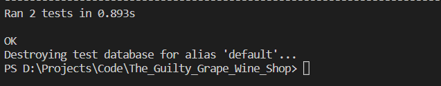  

* **Products App** 
Tests applied for user stories: **3A, 3B, 3D, 3F, 3G, 3H** 
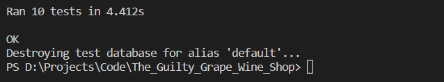  

* **Bag App** 
Tests applied for user stories: **3C, 6A, 6B, 6C, 6D, 6E, 6G** 
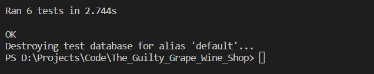  

* **Checkout App** 
Tests applied for user stories: **7A, 7B, 7C, 7D** 
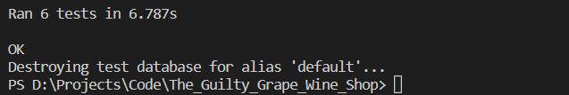  

* **Product Reviews App** 
Tests applied for user stories: **4A, 4B, 4C, 4D** 
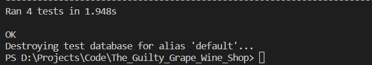  

* **Wishlist App** 
Tests applied for user stories: **5A, 5B, 5C, 5D** 
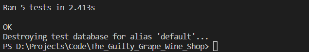  

* **Profiles App** 
Tests applied for user stories: **8A, 8B, 8C, 8D, 9A, 9B, 9C** 
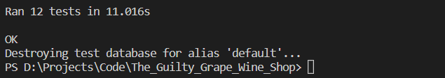  

* **Vouchers App** 
Tests applied for user stories: **6F** 
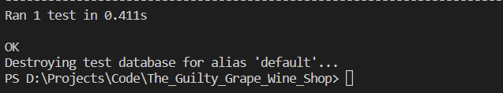  

* **Newsletter App** 
Tests applied for user stories: **10A** 
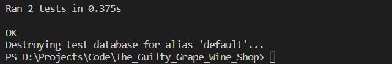  

### Test Coverage
For generating a report with the coverage of the automated tests, [coverage](https://coverage.readthedocs.io/en/coverage-5.5/) module was used. 
The full report can be found [here](https://github.com/useriasminna/the-guilty-grape-wine-shop/blob/main/static/reports/test_coverage.xlsx).

## Browser Testing
The website was tested on different browser for assuring the features work accordingly.
* Chrome
* Edge
* Safary
* Opera
* Firefox

## Code Validation
### HTML

The html code of the website was validated using [W3 Markup Validator](https://validator.w3.org/). 
At the time of deployment the validation have the following outcome:  

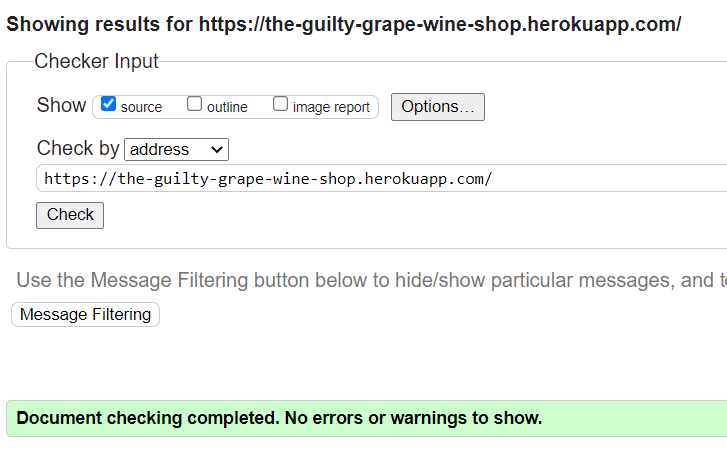  

The following pages have been tested:
* Home
* Products
* Product details
* Bag
* Checkout
* Checkout Success
* User Profile
* Admin Orders
* Wishlist
* Login/Register
* 403/404/500 custom pages

### CSS

The CSS code was validated using [W3 Jigsaw Validator](https://jigsaw.w3.org/css-validator/) 
At the time of deployment the validation for *base.css* has the following outcome:  

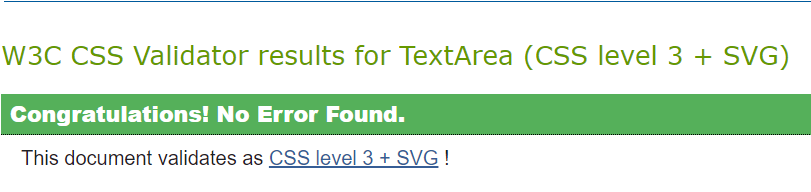  

### Javascript

The Javascript code was validated using using [JsHint](https://jshint.com/) 
At the time of deployment the validation for *script.js* has the following outcome:  

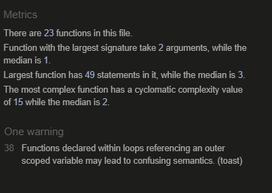  

* The warnings appeared because of EventListeners added to elements in a loop. 
I tried to solve the issue but no successful method has been found, so I chose to ignore the warning as it is not affecting the way my code works in any way.
* The script for defining the Stripe methods contains *Stripe* variable that generate the error in the linter. As this is a script taken and adapted from the [Stripe Documentation](https://stripe.com/docs/development), I choose to ignore this issue as there is no fix found for it. 

### Python
The python code was tested using [pycodestyle](https://pypi.org/project/pycodestyle/) online validator. 
At the time of deployment the python code validation has the following outcome:  

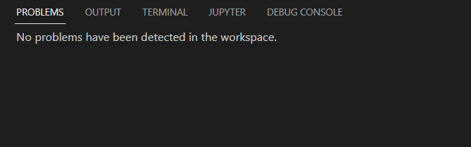  

### Accesibility 
The accesibility of the website was tested with [Wave](https://wave.webaim.org/)

**Wave results:** 

Home page

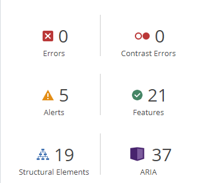  

Products page

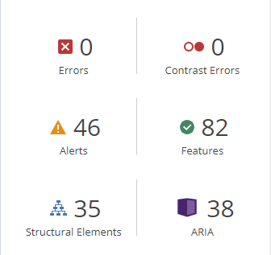  

Product details page

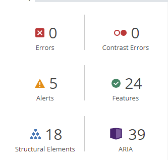  

Bag page

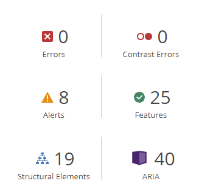  

Checkout page

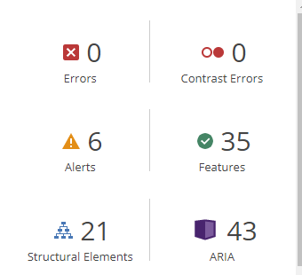  

Checkout Success page

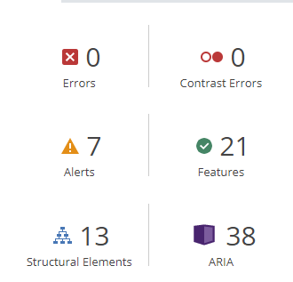  

User Profile page

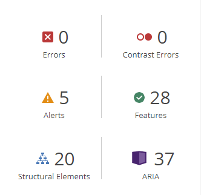  

Admin Orders page

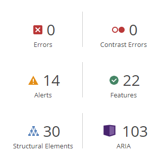  

Wishlist page

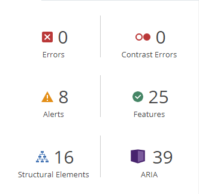  

Login page

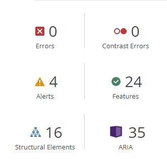  

Register page

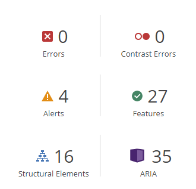  

 

### Performance
The performance of the website was tested with [Google Lighthouse](https://developer.chrome.com/docs/lighthouse/overview/)

**Lighthouse reports:** 

Desktop

* Home page 
  

* Products page 
  

* Product details page 
  

* Bag page 
  

* Checkout page 
  

* Checkout Success page 
  

* User Profile page 
  

* Admin Orders page 
  

* Wishlist page 
  

* Login page 
  

* Register page 
  

Mobile
  

* Home page 
  

* Products page 
  

* Product details page 
  

* Bag page 
  

* Checkout page 
  

* Checkout Success page 
  

* User Profile page 
  

* Admin Orders page 
  

* Wishlist page 
  

* Login page 
  

* Register page 
  

 

## Bugs 
* **Header padding**
    Because the header is implemented with <code>position: fixed</code>, I had to set a <code>padding-top</code> for the main container so it appears as if it is positioned below the header's content. In order to find the <code>padding-top</code> value that matches the header's height for every device, I used javascript to dynamically adjust it. This is why when testing the website for responsiveness using <b>dev tools</b>, the padding only changes its value on page reload. This bug is not visible when testing on real devices.  
* **Pagination**
    I have tried to implement pagination for the Products page using the class-based view <code>ListView</code> by setting the <code>paginate_by</code> value. The implementation didn't succeed as it seems that the view's feature doesn't work properly with filtered querysets. An alternative way of doing the pagination would be by using javascript but I didn't consider it as being completely necessary and I left it for future implementations because of time constraints.

* **Form reloads page** 
    The bug here is the fact that when a user submits any kind of form,  the page is reloaded and the user is brought to the top of the page. This results in a decrease in the user experience's quality because sometimes the user has to scroll back to the element where the action has been performed. This issue applies for <b>Newsletter subscribe</b>, <b>Update wishlist</b>, <b>Add/Update review</b> and <b>Update product quantity in shopping bag</b> features. As a solution for this issue, I added a <code>#section_id</code> to the redirecting URL in the views. This solution was used for <b>Newsletter subscribe</b> and  <b>Add/Update review</b> forms' post methods and it can be said that the user experience's quality has been increased. Another issue has appeared though, considering that the hash is now visible in the page URL and should be found a propper way of hiding it from the user.
     

Back to [README.MD](README.MD) 
 
 